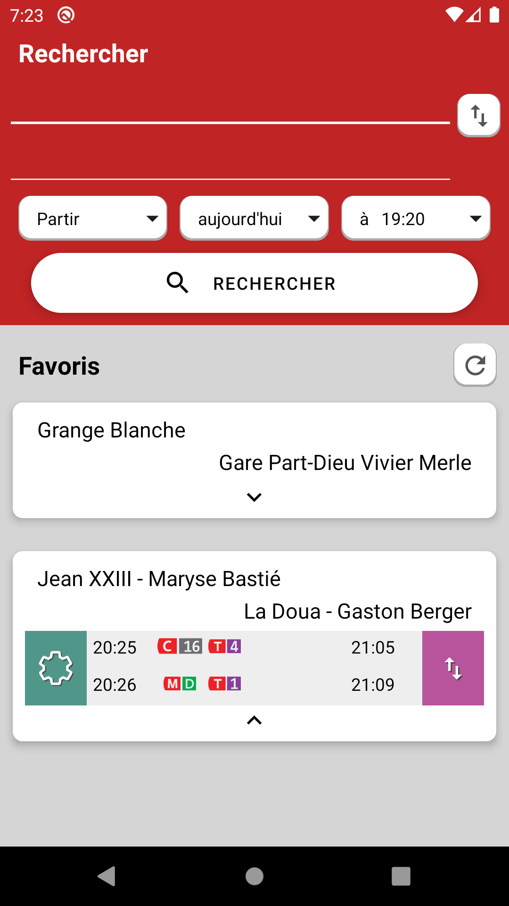

# TCL Watcher

App for [Lyon's subways and bus](http://tcl.fr/) using Jsoup : there is no API that calculate routes from, say, unique station IDs (even if they have one) ; instead, ultra long URLs are used, then meaningful HTML page elements are extracted and shown in the front end.

Download the app : [here](https://github.com/eviallet/TCLWatcher/releases/tag/v1.0.2)

    

# How it works

A list of the stations and their positions is downloaded from [here](https://download.data.grandlyon.com/wfs/rdata?SERVICE=WFS&VERSION=2.0.0&outputformat=GEOJSON&maxfeatures=100000&request=GetFeature&typename=tcl_sytral.tclarret) and stored in a local db. Their position is used to show the user the final route with [osmdroid](https://github.com/osmdroid/osmdroid) and their name to autocomplete the queries.

The [Request](app/src/main/java/com/gueg/tclwatcher/routes/Request.kt) class transforms the name strings and dates into their endless URL.
The [RouteParser](app/src/main/java/com/gueg/tclwatcher/routes/RouteParser.kt) class handles the Jsoup query from a Request; it returns a [Route](app/src/main/java/com/gueg/tclwatcher/routes/Route.kt) if everything was successful, show a [StationConflictDialog](app/src/main/java/com/gueg/tclwatcher/stations/StationConflictDialog.kt) if a station had more than one match (the "refined" fields of Request are then used), or raises an error if something went wrong.

Each Route is made of SubRoutes which represents the steps from A to B.

The mobile version of the site is used when parsing Requests since each page is more than 3 times lighter.
